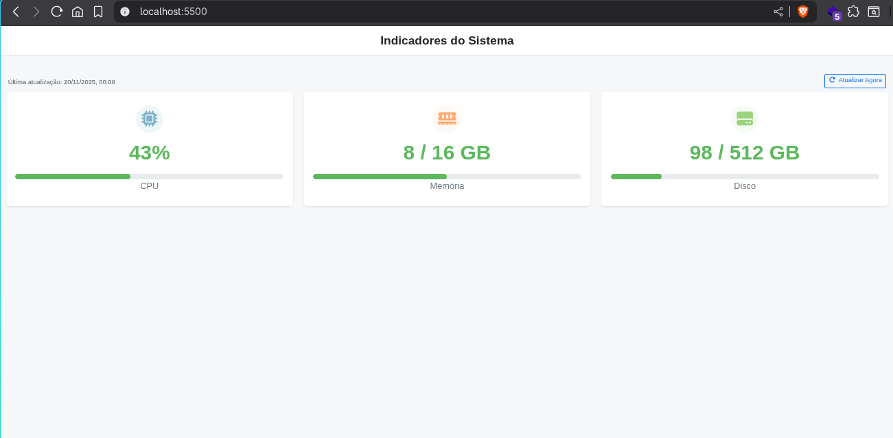

# Desafio Indicadores

Projeto front-end que exibe indicadores do sistema (CPU, Memória, Disco) em cards com barras de progresso. Valores são gerados aleatoriamente para demonstração.

---

## Descrição

Este repositório contém uma página estática que mostra indicadores do sistema em tempo real (simulados). Cada indicador tem:
- um valor exibido (por exemplo `42%` ou `8 / 16 GB`)
- uma barra de progresso que segue o valor
- mudança de cor conforme o nível (verde/amarelo/vermelho)

O objetivo é um desafio simples para demonstrar organização de código em módulos ES, atualizações periódicas e um layout responsivo com Bootstrap.

## Tecnologias utilizadas

- HTML5
- CSS (custom + Bootstrap 5)
- JavaScript (ES modules)

Estrutura relevante:

```
desafio-indicadores/
├─ index.html
├─ js/
│  ├─ main.js       # entrypoint (module)
│  ├─ ui.js         # manipulação do DOM e render
│  ├─ utils.js      # funções utilitárias (gerar valor, selecionar cor)
│  └─ config.js     # constantes/indicadores/cores
```

## Como executar localmente

Requisitos: navegador moderno com suporte a ES modules.

Passos rápidos (porta 8000):

```bash
# a partir da raiz do repositório
python3 -m http.server 8000
# Depois abra: http://localhost:8000
```

## Screenshots

Adicione capturas em `docs/` ou imagens no diretório `assets/` e referencie aqui. Exemplo:




